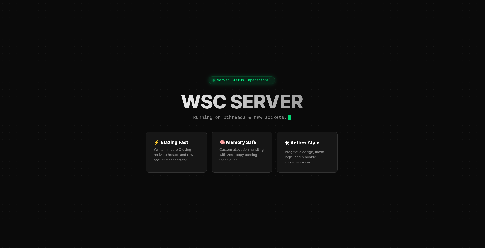

# WSC
<p align="center">
  
</p>
WSC is a HTTP server Written in C with permorfance in mind.

```C
#include "http.h"
#include <stdio.h>

int main(int argc, char **argv) {
  int port = 6969;
  char *addr = INADDR_ANY;

  http_server_t *server = httpCreateServer(addr, port);
  if (server == NULL) {
    fprintf(stderr, "Fatal: Could not start server on port %d\n", port);
    return 1;
  }

  httpServe(server);

  httpFreeServer(server);
  return 0;
}
```

### Error Pages
Error pages credits go to https://github.com/ToBiDi0410/error-pages?tab=readme-ov-file

